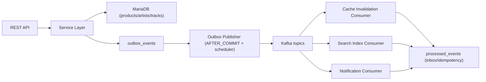

# Soundwave

Event-driven backend service for a music catalog, built with Java 25, Spring Boot 4, MariaDB, Kafka, and Redis.

The API manages artists/products/tracks. State changes create domain events, and consumers react to those events.

## Status

This repository is **Phase 1**: the catalog write-side, transactional outbox, idempotent event consumers, cache invalidation via events, and the operational scaffolding around them. It is the foundation the rest of the system grows on top of.

**Phase 2** — release pipeline (auto-validation, optional manual review, scheduled release on `releaseDate`, provider fan-out) is designed and documented but intentionally not built. The patterns under it (outbox, inbox, cache invalidation) are already in Phase 1 and would be reused as-is.

> **→ See [Domain Evolution (Phase 2)](docs/domain-evolution.md) for the target shape.**

## Architecture



## Key Decisions

- **Transactional outbox**: DB state + outbox row are written in one transaction.
- **At-least-once publish**: outbox publisher sends pending rows asynchronously after commit.
- **Dual publish trigger**: a Spring `@TransactionalEventListener(AFTER_COMMIT)` fires the publisher as a fast path; a fixed-delay scheduler is the safety net so a missed trigger or restart never strands pending rows.
- **Idempotent consumers**: `processed_events(event_id, consumer_group)` blocks duplicate side effects.
- **Inbox pattern in consumers**: each consumer group stores processed IDs in `processed_events` before business logic.
- **DLT is quarantine, not final sink**: current scope logs + metrics DLT events; recovery worker/replay flow is planned.
- **Clear event policy**: only meaningful catalog events are published (`ProductPublished`, `ProductTakenDown`, `ProductMetadataUpdated`, `TrackListUpdated`, `ArtistUpdated`).
- **Soft delete via takedown**: `DELETE /products/{id}` is mapped to takedown. Once published, products are quarantined rather than destroyed so downstream consumers (search index, cache, notification) stay consistent with the events they already received. Hard delete with no compensating event would create silent drift.

Draft products do not produce events.

## Event Contract

- One envelope shape: `eventId`, `eventType`, `payload`
- One schema source: `CatalogEventSchema`
- Fail-fast validation at consumer entry (envelope + event type)
- Payload shape checks are kept in consumer/domain logic for now

Details: [Event Contract Governance](docs/event-contract-governance.md)

## Observability

- **Logging**: JSON logs via Logstash encoder
- **Correlation**: `X-Request-Id` and `X-Correlation-Id` propagated through MDC
- **Metrics**:
  - `outbox.events.pending` (gauge — current backlog)
  - `outbox.events.failed` (gauge — permanently failed rows)
  - `outbox.events.published` (counter — throughput)
  - `outbox.events.publish.failures` (counter)
  - `outbox.publish.duration` (timer — per-event publish latency)
  - `outbox.publish.batch.size` (distribution — events per flush)
  - `outbox.dlt.events` (counter)
- **Monitoring**: Prometheus alert rules + Grafana datasource and dashboard provisioning
- **Dashboard**: *Soundwave — Outbox Health* (provisioned from [`monitoring/grafana/dashboards/outbox-health.json`](monitoring/grafana/dashboards/outbox-health.json)) — backlog, throughput, publish latency, batch size, DLT rate. Available at http://localhost:3000 after `docker compose up`.

Runbook: [Runbook Lite](docs/runbook-lite.md)
DLT recovery plan: [DLT Recovery Plan](docs/dlt-recovery-plan.md)
Metrics/dashboard plan: [Metrics and Grafana Plan](docs/metrics-and-grafana-plan.md)

## Decision Records

- [ADR-001: Transactional Outbox With Ordered Publish](docs/adr/ADR-001-transactional-outbox.md)
- [ADR-002: Idempotent Consumer Via Processed Event Key](docs/adr/ADR-002-idempotent-consumer.md)
- [ADR-003: Event Envelope And Schema Guard](docs/adr/ADR-003-event-envelope-and-schema.md)
- [ADR-004: Cache Invalidation Via Events](docs/adr/ADR-004-cache-invalidation-via-events.md)
- [Trade-offs](docs/trade-offs.md)
- [Release Safety](docs/release-safety.md)
- [Security](docs/security.md)
- [Domain Evolution (Phase 2)](docs/domain-evolution.md)

## Tech Stack

| Component | Technology |
|---|---|
| Language | Java 25 |
| Framework | Spring Boot 4.0 |
| Database | MariaDB 11 |
| Migrations | Flyway |
| Messaging | Apache Kafka (KRaft) |
| Cache | Redis 7 |
| Metrics | Micrometer + Prometheus + Grafana |
| Logging | Logstash Logback Encoder |
| API Docs | SpringDoc OpenAPI |
| Testing | JUnit 5 + Testcontainers |
| CI | GitHub Actions |

## Run Locally

### Prerequisites

- Docker + Docker Compose

### Start all services

```bash
docker compose up --build
```

| Service | URL |
|---|---|
| API | http://localhost:8080 |
| Swagger UI | http://localhost:8080/swagger-ui.html |
| Prometheus | http://localhost:9090 |
| Grafana | http://localhost:3000 (`admin` / `admin`) |

### Infra only (run app from IDE)

```bash
docker compose up mariadb kafka redis -d
```

Kafka bootstrap for local app run: `localhost:29092`

## Load Test (k6)

Declarative k6 scenario that drives the full write-side flow (create artist → product → tracks → publish → update → takedown) plus a low-rate "chaos" scenario that fires intentionally invalid requests so 4xx error rates appear on dashboards. Everything goes through the real outbox → Kafka → consumer path, so backlog, publish throughput, latency, and batch-size panels on *Outbox Health* light up.

```bash
docker compose --profile load run --rm k6
```

Watch it live on:
- Grafana → *Soundwave — Outbox Health* — http://localhost:3000
- Prometheus — http://localhost:9090

To force real publish failures, stop Kafka briefly while the test runs:

```bash
docker compose stop kafka   # pending + failure rate climb
docker compose start kafka  # publisher recovers on next tick
```

Script: [`k6/catalog-load.js`](k6/catalog-load.js). Override base URL for a host-installed k6 via `BASE_URL=http://localhost:8080/api/v1 k6 run k6/catalog-load.js`.

## Run Tests

```bash
./gradlew unitTest
./gradlew integrationTest
```

Integration tests require Docker (Testcontainers).

## CI

GitHub Actions runs on push and PR to `main`:

1. **build** — JDK 25 setup, `clean compileJava`
2. **test** — `unitTest` then `integrationTest` (depends on build)

Workflow: [.github/workflows/ci.yml](.github/workflows/ci.yml)

## Testing Strategy

- Unit tests for service decisions and domain invariants
- Event contract tests for schema and validation
- Repository integration tests (MariaDB/Testcontainers)
- Integration tests for outbox write flows
- Unit tests for idempotent consumer duplicate-path behavior
- Distributed messaging tests should use Kafka Testcontainers, not mocked Kafka flows

## API Overview

### Products

| Method | Endpoint | Description                             |
|---|---|-----------------------------------------|
| POST | `/api/v1/products` | Create product as draft                 |
| GET | `/api/v1/products/{id}` | Get product details                     |
| GET | `/api/v1/products` | List products (paginated)               |
| PUT | `/api/v1/products/{id}` | Update product metadata                 |
| POST | `/api/v1/products/{id}/publish` | Publish product                         |
| POST | `/api/v1/products/{id}/takedown` | Take down product                       |
| DELETE | `/api/v1/products/{id}` | Delete (mapped to takedown temporarily) |
| POST | `/api/v1/products/{id}/tracks` | Add track                               |
| DELETE | `/api/v1/products/{id}/tracks/{trackId}` | Remove track                            |
| PUT | `/api/v1/products/{id}/tracks/order` | Reorder tracks                          |

### Artists

| Method | Endpoint | Description |
|---|---|---|
| POST | `/api/v1/artists` | Create artist |
| GET | `/api/v1/artists/{id}` | Get artist |
| GET | `/api/v1/artists` | List artists (paginated) |
| PUT | `/api/v1/artists/{id}` | Update artist |

## Project Structure

```
src/main/java/com/soundwave/
├── api/                 # controllers, contracts, services, validation, advice
├── config/              # app configuration and filters
├── domain/              # core entities and result/error model
└── infrastructure/      # persistence + messaging
```

## Roadmap

### Next — finishing Phase 1
Concrete polish items on the current code, grouped by area:

- **Testing** — add Kafka Testcontainers coverage for retry/DLT/replay paths; add fitness tests for the event contract (envelope invariants and allowed event types); add JaCoCo coverage reporting in CI with a baseline threshold for service and domain layers.
- **Robustness** — tighten duplicate-key detection to a SQL-state / constraint-level check; implement the DLT recovery worker + replay flow (quarantine model, not drop model); add a `processed_events` retention job (delete rows older than the longest expected Kafka replay window).
- **Observability** — enrich OpenAPI documentation for all endpoints and common error responses; add Grafana dashboards for API latency and consumer lag (Outbox Health is already provisioned).
- **Security** — apply the plan in [Security](docs/security.md): split actuator ports, restrict scrape access, add auth at the edge.

### Later — Phase 1 hardening at scale
Longer-horizon items still inside the Phase 1 surface:

- Secure resources and deploy to k3s with environment-specific configs and secrets.
- Run consumers in separate JVM processes for independent scaling and isolation.
- Read model split for heavy list queries.
- Artist/product search API backed by a real search engine (ElasticSearch or similar).
- Load and resilience testing with latency and error baselines.

### Phase 2 — release pipeline
Auto-validation, optional manual review, scheduled release on `releaseDate`, and provider fan-out. Designed and documented but intentionally not built; the patterns under it (outbox, idempotent consumers, cache invalidation) are already in Phase 1 and would be reused as-is.

→ [Domain Evolution (Phase 2)](docs/domain-evolution.md)
